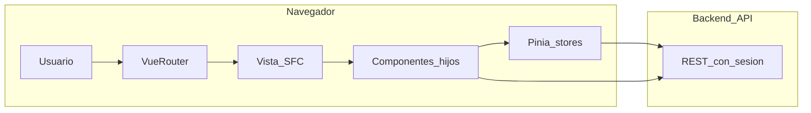

# Documentación funcional: frontend Cursos Estudia y Trabaja (`cursosvue`)

Este documento describe el **modelo de negocio** que orienta la plataforma y, **componente por componente**, qué hace cada pieza del código en el repositorio Vue 3. Las rutas de archivo son relativas a la raíz del proyecto `cursosvue`.

---

## 1. Contexto de negocio (visión del producto)

La plataforma vende **paquetes de cursos** cuyo contenido está pensado para vivir en **Google Drive** (acceso vía cuenta Gmail / unidades compartidas). El catálogo se organiza en **múltiples categorías** de paquetes (por ejemplo, alrededor de **23 categorías** en la oferta comercial), con el objetivo de cubrir **diversidad de temas** y una buena experiencia de descubrimiento.

### Modelo de monetización para usuarios revendedores

Se contemplan tres líneas complementarias (descripción de producto):

1. **Link de afiliado**: el comprador entra por una URL que identifica al referente; el sistema puede aplicar descuentos o comisiones según las reglas del backend.
2. **Código promocional (cupón)**: precio o condiciones especiales validadas contra el servidor antes de pagar.
3. **Venta por retail**: el revendedor fija su precio al cliente final y la plataforma recibe una parte acordada del valor (la lógica contable y de liquidación vive principalmente en backend; el front expone flujos de compra y herramientas de afiliado/cupón y, en el modal de compra, una opción de compra “para otra persona” alineada con regalo/reventa).

### Áreas funcionales esperadas por el usuario

| Área | Descripción |
|------|-------------|
| **Landing** | Página de inicio que resume valor (acceso vitalicio, Drive, pagos, monetización, testimonios, FAQ). |
| **Categorías / cursos** | Listado de paquetes, detalle con temario, FAQ, cantidades, compra y carrito; buscador global en cabecera. |
| **Monetización** | Explicación y acceso a modelo de ingresos (afiliados, comisiones). |
| **Mis cursos** | Paquetes ya comprados y enlace al Drive. |
| **Perfil / configuración** | Datos de contacto, cuentas para desembolsos (Nequi, Daviplata, llave), historial de ventas y reembolsos. |
| **Agente de IA** (roadmap) | Asistente para preguntas y apoyo a la venta; ver sección 2 sobre estado en código. |

---

## 2. Visión de producto frente al código actual (transparencia)

| Tema | En el producto / narrativa | En el código actual |
|------|---------------------------|---------------------|
| **Número de categorías (p. ej. 23)** | Referencia comercial. | Las categorías vienen del **API** (`CategoryService`); no hay constante `23` en el front. El número real depende del backend y de filtros (p. ej. solo no compradas en listado paginado). |
| **Agente de IA** | Buscador inteligente / vendedor virtual. | **No hay** componente, servicio, iframe ni integración con modelos de IA en `src/`. El buscador del header es **búsqueda de texto** sobre categorías vía API. |
| **Retail** | Revendedor fija precio y paga comisión a la plataforma. | No hay pantalla con el término “retail”. Existe el modo **“Para otra persona (Regalo/Venta)”** en el modal de compra (`emergent.buy.component.vue` + `UserExternal` en `EmergentBuyStore`), con verificación de correo y `google_id` del destinatario para asociar el acceso. La comisión exacta es responsabilidad del backend. |
| **Sección “Monetizar” en navegación** | Apartado propio. | El enlace del header con etiqueta **“Monetizar”** apunta a la **misma ruta** que **“Cursos”** (`name: 'courses'`). Solo cambia el ícono y el resaltado cuando la ruta coincide con `/courses`. No existe ruta `/monetizar` registrada en el router. |
| **FAQ en home** | Bloques de preguntas. | `section.six` tiene FAQ ricas; **no están montadas** en `home.component.vue`. `section.three` está **vacía** en plantilla. |
| **Reseñas en ficha de curso** | Tab “Reseñas”. | La ficha activa muestra **“Comentarios próximamente”**. Existe `comments.body.component.vue` con integración a `MessageService`, pero **no está montado** en `course.info.page.vue`. |

---

## 3. Stack técnico

- **Vue 3** (Composition API, `<script setup>`).
- **Vue Router 4** — rutas en `src/router/`.
- **Pinia** — estado global en `src/store/`.
- **Vite 6** — build y dev server (puerto 3001 en script `dev`).
- **Tailwind CSS 4** + **DaisyUI** (dependencias).
- **Quasar** — algunos componentes (p. ej. `q-page` en admin).
- **Axios** — cliente HTTP encapsulado en `ApiService`.
- **vue3-google-login** — inicio de sesión con Google en `App.vue` y header.
- **ApexCharts** (`vue3-apexcharts`) — gráficos en panel admin (widget de estadísticas).

---

## 4. Flujo de alto nivel (usuario → datos)

---

## 5. Rutas registradas

Definidas en `src/router/index.ts` a partir de cuatro archivos. La meta `showHeader: true` hace que `App.vue` muestre el header fijo (excepto rutas admin con `false`).

| Ruta | Nombre (`name`) | Componente principal | Propósito |
|------|-----------------|----------------------|-----------|
| `/` | `home` | `src/home/home.component.vue` | Landing. |
| `/cart` | `cart` | `src/cart/cart.page.vue` | Carrito a página completa (móvil). |
| `/mis-courses` | `mycourses` | `src/components/auth/my.courses.page.vue` | Paquetes comprados. |
| `/*` catch-all | — | `src/components/notfound.vue` | 404. |
| `/login` | `login` | `src/components/auth/login.component.vue` | Login. |
| `/register` | `register` | `src/components/auth/register.component.vue` | Registro. |
| `/config` | `config` | `src/components/auth/account/my.account.page.vue` | Menú de configuración. |
| `/config/user` | `config-user` | `src/components/auth/account/config.user.page.vue` | Cuentas de desembolso y WhatsApp. |
| `/config/sales` | `sales-user` | `src/components/auth/sales/sales.page.vue` | Hub de ventas (usuario). |
| `/config/sales/managenent` | `sales-management-user` | `src/components/auth/sales/accountManagement/management.account.page.vue` | **Nota:** typo `managenent` en la ruta. |
| `/config/sales/refund` | `sales-refund-user` | `src/components/auth/sales/refundHistory/refund.history.page.vue` | Reembolsos usuario. |
| `/config/sales/detail` | `sales-detail-user` | `src/components/auth/sales/salesHistory/sail.history.page.vue` | Detalle de ventas usuario. |
| `/courses` | `courses` | `src/courses/courses.component.vue` | Listado de categorías. |
| `/courses/:id` | `courses-description` | `src/courses/courseInfoPage/course.info.page.vue` | Ficha del paquete. |
| `/:googleid/affiliaty/:id` | `affiliaty` | Misma ficha que arriba | Entrada por afiliado; `beforeEnter` fuerza login o guarda `path_referido`. |
| `/admin` | `admin` | `src/pages/admin.page.vue` | Panel admin (sin header global). |
| `/admin/refund` | `sales-admin-refund-user` | `src/components/admin/sales/refundHistory/refund.admin.history.page.vue` | Reembolsos admin. |
| `/admin/managment` | `sales-admin-management-user` | `src/components/admin/sales/accountManagement/management.admin.account.page.vue` | Gestión cuentas admin. |

El panel admin enlaza también a la ruta con nombre `sales-detail-user` (compartida con usuario) para “Detalle de Ventas”; conviene validar en proyecto si es intencional.

---

## 6. Shell de aplicación

### `src/App.vue`

- Monta `HeaderComponent` si `route.meta.showHeader`.
- Aplica padding superior cuando hay header (`pt-28`).
- Incluye `GoogleLogin` oculto con `auto-login` para renovar sesión.
- En `onMounted`: obtiene perfil (`AuthService.getProfile`), carga categorías (`categoryStore.fetchCategories()`).
- Si existe `google_affiliaty` en `localStorage`, consulta datos del afiliado y rellena `nameAffiliaty` y cupón en store.
- `watch` sobre el perfil: si había `path_referido` (flujo afiliado + registro), redirige al enlace completo tras autenticarse.

### `src/components/header/header.component.vue`

- Barra fija: logo, título “CURSOS ESTUDIA Y TRABAJA”, login con Google o menú de usuario (Mis Cursos, Configuración).
- Navegación inferior: Inicio, Cursos, **Monetizar** (misma URL que Cursos), Mis Cursos (solo si `user.is_bought`).
- `HeaderSearchComponent`, botón registrar (desktop), icono de carrito: en desktop abre **panel lateral** con `CartPage` embebido; en móvil navega a `/cart`.
- Estado `positionNavigate` para subrayado activo según ruta (incluye `monetizar` si la ruta fuera `/monetizar`, hoy no registrada).

### `src/components/header/header.search.component.vue`

- Input con debounce implícito vía `watch` del modelo.
- Llama `CategoryService.searchCategories(texto, 8)` y muestra dropdown.
- Al elegir categoría: navega a `courses-description` con `params.id` y `query.q_course` para prellenar búsqueda en la lista completa del paquete.

### `src/components/header/headerIcons.ts`

- SVG embebidos como strings para íconos de navegación y carrito.

### `src/components/footer/footer.component.vue`

- Pie de página reutilizado en home, cursos, carrito, mis cursos, configuración, etc. (contenido según implementación del archivo).

---

## 7. Landing (`src/home/`)

### `src/home/home.component.vue`

Orquesta secciones en este orden: `SectionOne`, `SectionTwo`, `SectionFour`, `SectionTestament`, `SectionThree`, `footerComponent`.

**Observación:** importa `SectionFiveComponent` y `SectionSixComponent` pero **no los usa** en el template (código muerto de importación).

### `src/home/section_one/section.one.component.vue`

- Hero visual: imagen + cuatro tarjetas (Acceso vitalicio, 100% descargable, Club de descuentos, Trabaja y gana / comisiones).
- Iconos desde `section.one.data.ts`.

### `src/home/section_two/section.two.component.vue`

- Carrusel infinito de logos de plataformas (Coursera, edX, Hotmart, Platzi) con animación CSS.

### `src/home/section_three/section.three.component.vue`

- **Plantilla vacía**; no renderiza contenido.

### `src/home/section_four/section.four.component.vue`

- Tres tarjetas tipo FAQ resumido (acceso Drive, estudio/certificación, pagos y seguridad) con botones “Leer respuesta” (sin acordeón conectado en el snippet revisado).

### `src/home/section_five/section.five.component.vue`

- Sección “CURSOS MÁS PEDIDOS” con scroll horizontal y múltiples instancias de `best.sallers.component.vue`.
- **No montada** en `home.component.vue` en el estado actual.

### `src/home/section_five/best.sallers.component.vue`

- Tarjeta de curso destacado para el carrusel de la sección cinco (usada solo si se vuelve a incluir la sección en home).

### `src/home/section_six/section.six.component.vue`

- Bloque grande de **preguntas frecuentes** (Drive, monetización 60 %, etc.) con acordeones.
- **No montada** en `home.component.vue` en el estado actual.

### `src/home/section_seven/section.testament.component.vue`

- Testimonios o prueba social (según contenido del archivo).

---

## 8. Catálogo y ficha de paquete

### `src/courses/courses.component.vue`

- Paginación por **scroll infinito**: pide lotes de 6 categorías con `CategoryService.getAllCategories(pageSize, offset)`.
- Filtra y muestra solo categorías con `user_bought === false`.
- Sincroniza lista acumulada con `categoryStore.setCategories`.
- Muestra aviso si hay `nameAffiliaty` en store.
- Pasa `refer-code` a cada tarjeta según `localStorage.google_affiliaty` si el usuario no ha comprado aún.
- Incluye `EmergentBuyComponent` global del listado.
- `FooterComponent` al final.

### `src/courses/course.component.vue`

- Tarjeta de un `ICategory`: título, frase, imagen, badges informativos, precio, botones **Comprar** (abre modal vía `emergentBuyStore`), **Añadir al carrito** (requiere sesión; valida duplicados en `cartStore`).
- `AffiliatyMessageComponent` para compartir link de afiliado por categoría.
- Navegación al detalle con `courses-description`.

### `src/courses/courseIcons.ts` y `src/courses/courseInfoPage/courseInfo.icons.ts`

- Strings SVG para iconografía de tarjetas y pestañas de la ficha.

### `src/courses/courseInfoPage/course.info.page.vue`

Página central del paquete:

- Carga categoría desde cache (`findCategoryById`) y refresca con `CategoryService.getCategoryById`.
- Ruta afiliado: si hay `googleid` en params, llama `AuthService.get_affiliaty`, guarda nombre y `localStorage.google_affiliaty`.
- Banner ámbar si compra con descuento de afiliado.
- **Pestañas:** Contenido (temario), Preguntas (FAQ desde `category.pregunta_respuesta`), Comentarios (placeholder), Beneficios (texto fijo).
- **Temario:** tres bloques colapsables — Plataformas, Temas, Lista completa — con paginación interna; lista completa con **buscador local** y soporte de `query.q_course` para scroll automático desde el buscador global.
- Columna lateral sticky: imagen, precio (COP/USD según `user.country`), **Comprar ahora**, **Añadir al carrito**, `AffiliatyMessageComponent`, lista de inclusiones.
- Monta `EmergentBuyComponent`.

### `src/courses/courseInfoPage/componentCourseInfo/course.img.component.vue`

- Vista alternativa de ficha de curso (imagen, precio, carrito, afiliado) basada en `categoryStore` y ruta; **no está importada** en ningún otro archivo del `src/` revisado (código huérfano o reserva para otra ruta).

### `src/courses/courseInfoPage/componentCourseInfo/course.body.info.component.vue`

- Layout tipo acordeón con lista de cursos (`storeCategory.getCategory()?.courses`), autores y embebe `QuestionsBodyComponent` y `CommentsBodyComponent`. **No está importada** en el router ni en `course.info.page.vue` en el estado actual.

### `src/courses/courseInfoPage/componentCourseInfo/questions.body.component.vue`

- FAQ estática en `
` (fechas, alojamiento en Drive, certificado, WhatsApp). Solo sería visible si se monta `course.body.info.component.vue` o se importa explícitamente.

### `src/courses/courseInfoPage/componentCourseInfo/comments.body.component.vue`

- **Reseñas reales** vía `MessageService.getAllMessageByCategory`, promedio de estrellas y distribución; permite enviar mensajes con `MessageService.addMessage`. **No está conectada** a la ficha activa `course.info.page.vue` (esa pestaña muestra “Comentarios próximamente”). Este archivo es la implementación lista para reutilizar cuando se sustituya el placeholder.

---

## 9. Compra, pagos y modal emergente

### `src/courses/emergent.buy.component.vue`

Modal **“Personaliza tu compra”**:

- Tres modos alineados con `OptionsEmergentBuy` en store:
  - **Para mi uso personal** (`UserInternal`): pago PayU o PayPal para el usuario logueado; si hay afiliado en `localStorage`, se añade su `google_id` al `value_extra` de PayU.
  - **Para otra persona (Regalo/Venta)** (`UserExternal`): verificación de correo con `AuthService.verificarEmail`, obtiene `google_id` del destinatario; pago con email del destinatario en PayU o PayPal externo.
  - **Cupón** (`UserInternalCupon`): validación con `storeemergentBuy.validarCupon` → endpoints `payu-firm-cupon` / PayPal cupón; al abrir modal, si venía de afiliado puede precargar cupón del store.
- Checkbox “tengo cupón”; cálculo de precio final y descuento con `cuponResponse`.
- Si el país del usuario **no es `CO`**, fuerza **solo PayPal** (`isOnlyPaypal`).
- CTA de **upgrade**: si existe categoría “padre” o pack superior (`premiumTargetCategory`), navega a esa ficha.
- Usa `AlertNotification` para feedback.

### `src/store/EmergentBuyStore.ts`

- Estado del modal (`emergent`), categoría seleccionada, modo de compra, pasarela (PayU/PayPal), `cuponResponse`.
- `buyCategory()` centraliza llamadas a `PaymentService` / `CuponService` y generación de formulario PayU (`usePayU`).

### `src/payu/usePayu.ts`

- Construye y envía formulario POST hacia PayU con firma y metadatos de categorías/usuario/afiliado.

### `src/cart/cart.page.vue`

- Lista del carrito (`cartStore`), total, modal de pago.
- `PaymentService.generate_signature_reference_code` para PayU múltiples categorías; PayPal carrito.
- Reacciona al ancho de ventana (sidebar vs página).
- Formateo de moneda COP para visualización.

### `src/cart/item.component.vue`

- Línea de ítem del carrito con posibilidad de eliminar (`cartStore.deleteItem`).

### `src/services/PaymentService.ts` y `src/services/Cupon.ts`

- Encapsulan POST a: `/payu-firm`, `/paypal-generate-link-pay`, `/paypal-generate-link-pay-external`, `/payu-firm-cupon`, `/paypal-generate-link-pay-cupon` (y duplicados en `Cupon.ts` con la misma API para flujos de cupón/firma).

---

## 10. Afiliados

### `src/components/auth/affiliaty.message.component.vue`

- Muestra acción **“Compartir link de afiliado”**.
- Si el usuario **compró** (`is_bought`), genera URL `/{google_id}/affiliaty/{id_categoría}` y la copia al portapapeles.
- Si no hay sesión → redirige a registro.
- Si hay sesión pero no compró → toast “Para ser miembro tienes que haber comprado”.
- Prop `variant`: estilos `default` o `card`.

### Flujo de ruta afiliado

`src/router/course.routes.ts`: `beforeEnter` comprueba perfil; si no hay usuario, guarda `path_referido` y manda a `register`. `App.vue` redirige tras login.

---

## 11. Autenticación y cuenta

### `src/components/auth/login.component.vue`

- Pantalla de login (flujo actual puede depender de Google; revisar template del archivo en el repo).

### `src/components/auth/register.component.vue`

- Registro de usuario; copy que menciona monetización y prueba.

### `src/components/auth/account/my.account.page.vue`

- Dashboard “CONFIGURACIÓN” con enlaces a: Configurar cuenta (`config-user`), Historial de ventas (`sales-user`), tarjeta “Ayuda” **sin enlace** (solo visual).
- Muestra mensajes flash según query `is_save` / `is_cancel` tras guardar cuenta.

### `src/components/auth/account/config.user.page.vue`

- Formulario **WhatsApp** (prefijo + número) y **cuentas de desembolso**: Nequi, Daviplata, llave electrónica.
- Validación obligatoria de todos los campos antes de enviar.
- `AccountService.updated(payload)`; redirección a `/config?is_save=true` o cancel a `is_cancel=true`.
- Hidrata desde `authStore.profile.user.accounts` y datos de teléfono del usuario.

---

## 12. Mis cursos

### `src/components/auth/my.courses.page.vue`

- `fetchCategories(true)` y filtra `getCategoriesBougth()` (`user_bought === true`).
- Tarjetas con imagen, título, conteo de cursos, `AffiliatyMessageComponent`, botón **Ver Mis Cursos** que abre `item.url` (Drive) en nueva pestaña.
- Clic en imagen/título → ficha `courses-description`.
- Estado vacío con CTA a listado de cursos.

---

## 13. Ventas y finanzas (usuario)

### `src/components/auth/sales/sales.page.vue`

- Menú con tres tarjetas: Reembolsos, Manejo de cuentas, Detalle de venta (navegación por `name` de rutas hijas).

### `src/components/auth/sales/accountManagement/management.account.page.vue`

- Filtro por fechas; `BalanceService.getBalance` y tarjetas: total cursos vendidos, ventas del periodo, reembolsado, sin reembolsar, ganancias netas.
- `FooterComponent`.

### `src/components/auth/sales/salesHistory/sail.history.page.vue`

- Ventas por rango de fechas: `SailService.getSailByUserAndDate`.
- Grid de tarjetas; modal con `SailComponentEmergent`.

### `src/components/auth/sales/salesHistory/sail.component.emergent.vue`

- Detalle ampliado de una venta (`ISail`) dentro del modal.

### `src/components/auth/sales/refundHistory/refund.history.page.vue`

- Listado paginado de reembolsos vía `AdminRefundService.getSearchRefunds` filtrado al `google_id` del usuario actual.
- Búsqueda con debounce, paginación numérica, modal `RefundComponentEmergent`.

### `src/components/auth/sales/refundHistory/refund.component.emergent.vue`

- Contenido del modal de un registro de reembolso.

---

## 14. Administración

### `src/pages/admin.page.vue`

- Similar al hub de ventas de usuario pero titulado “Panel Admin”; enlaces a rutas admin de reembolsos, manejo de cuentas y **misma** ruta nombrada `sales-detail-user` para detalle (verificar permisos en backend).

### `src/components/admin/sales/salesHistory/sail.history.admin.page.vue`

- Misma estructura que historial de ventas usuario pero usa `SailAdminComponentEmergent` (variante admin).

### `src/components/admin/sales/salesHistory/sail.admin.component.emergent.vue`

- Detalle de venta en contexto admin.

### `src/components/admin/sales/refundHistory/refund.admin.history.page.vue`

- Gestión de reembolsos para administradores (listados y acciones; revisar archivo para campos exactos).

### `src/components/admin/sales/refundHistory/refund.admin.component.emergent.vue`

- Modal de detalle / acción de reembolso admin.

### `src/components/admin/sales/accountManagement/management.admin.account.page.vue`

- Gestión de cuentas o balances a nivel admin; incluye formularios relacionados con `management.admin.refund.form.component.vue` según integración en la vista.

### `src/components/admin/sales/accountManagement/management.admin.refund.form.component.vue`

- Formulario admin para operaciones de reembolso o ajuste de cuenta.

### `src/components/admin/sales/widgets/SalesStatisticsWidget.vue`

- Widget con gráfico de área (ApexCharts) y rangos de fechas; consume `BalanceService` u otro endpoint agregado por semanas; acepta prop opcional `googleId` para filtrar por usuario.

---

## 15. Otros componentes

### `src/components/notfound.vue`

- Página 404 para rutas no definidas.

### `src/components/common/AlertNotification.vue`

- Notificaciones toast para el modal de compra y otros flujos.

---

## 16. Stores Pinia

| Store | Archivo | Responsabilidad |
|-------|---------|-----------------|
| `authStore` | `src/store/AuthStore.ts` | Perfil, nombre de afiliado activo, cupón asociado al afiliado. |
| `categoryStore` | `src/store/CategoryStore.ts` | Lista de categorías, cache en **Cache API** del navegador (`curso-api-cache-v1`), `fetchCategories`, comprados, `findCategoryById`. |
| `cartStore` | `src/store/CartStore.ts` | Ítems del carrito, validación de duplicados, contador, eliminación. |
| `emergentBuyStore` | `src/store/EmergentBuyStore.ts` | Modal de compra, categoría en contexto, cupón, orquestación PayU/PayPal. |

---

## 17. Servicios (capa API)

Todos usan `ApiService` (axios con `withCredentials: true`). Base URL según configuración del proyecto (típicamente variable de entorno en build).

| Servicio | Archivo | Uso principal |
|----------|---------|----------------|
| `ApiService` | `src/services/ApiService.ts` | Cliente HTTP genérico. |
| `AuthServices` | `src/services/AuthServices.ts` | Perfil, token Google, afiliado, verificación de email, etc. |
| `CategoryService` | `src/services/CategorieService.ts` | Listado, búsqueda, detalle de categoría. |
| `PaymentService` / `Cupon` | `PaymentService.ts`, `Cupon.ts` | Firmas PayU y enlaces PayPal (con y sin cupón / externo). |
| `AccountService` | `src/services/AccountService.ts` | Actualización de cuentas de desembolso y contacto. |
| `BalanceService` | `src/services/BalanceService.ts` | Agregados de balance para “Manejo de cuentas” y gráficos. |
| `Sail` | `src/services/Sail.ts` | Ventas por fechas. |
| `AdminService` | `src/services/AdminService.ts` | Búsqueda de reembolsos y operaciones admin exportadas. |
| `Refund` | `src/services/Refund.ts` | Operaciones de reembolso si aplica. |
| `MessageService` | `src/services/MessageService.ts` | `GET /all-messages/:id`, `POST /add-message-category` (reseñas por categoría en API; la pestaña “Reseñas” de la ficha aún no lo usa). |
| `UserService` | `src/services/UserService.ts` | Operaciones de usuario según necesidades del resto del app. |

---

## 18. Tipos y pruebas

- Tipos en `src/types/` (`Categorie`, `Auth`, `Payment`, `Sail`, `Balance`, etc.).
- Prueba unitaria de ejemplo: `src/services/__tests__/PaymentService.spec.ts`.

---

## 19. Resumen de decisiones UX relevantes

- **Buscador global** lleva al detalle del paquete y prefiltra la lista completa de cursos del temario.
- **Afiliado** se propaga por `localStorage` y cabeceras de contexto en pagos PayU.
- **Monetizar** en el menú es hoy un **segundo acceso visual** al listado de cursos, no una página distinta.
- **Secciones cinco y seis** del home están implementadas pero **desconectadas** del layout principal; reactivarlas solo requiere añadirlas al template de `home.component.vue`.

---

## 20. Mantenimiento del documento

Al añadir rutas, componentes o integraciones (por ejemplo, un **chat con IA**), actualizar: secciones 2, 5, el inventario por carpeta y la tabla de servicios. Este archivo fue generado a partir del código del repositorio `cursosvue` y describe comportamiento observado, sin garantizar reglas de negocio del backend que no estén reflejadas en el front.
